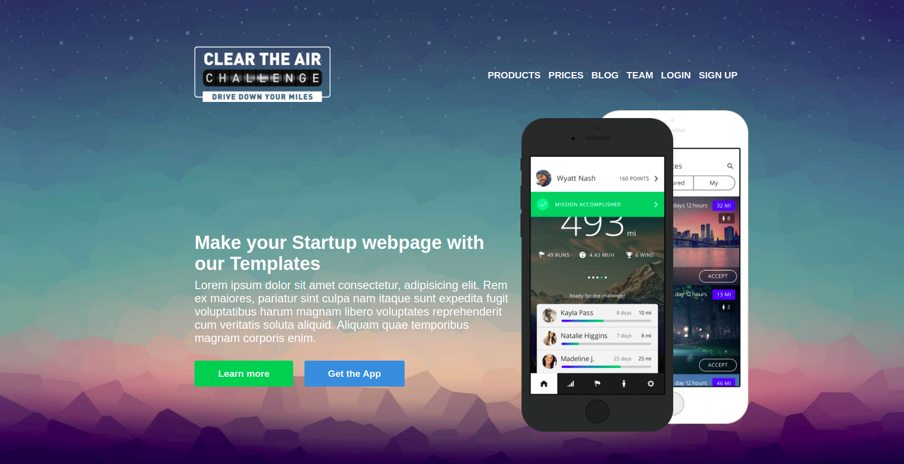

# Clear Sample

**[Test this app yourself](https://vincenzoarena.github.io/clearsample/)**

---

---

### About Project

As an exercise I used a given template to practice how to style a web page with the combined action of HTML and CSS.

### How to use this Project

This is a template that can be used to display some content and it can be altered easily thans to the Variables introduced using CSS.

##### Developed With

- [x] _HTML5_
- [x] _CSS3_
- [ ] _SASS_
- [ ] _SCSS_
- [ ] _JavaScript_
- [ ] _React_
- [ ] _Bootstrap_
- [ ] _npm_
- [x] _Markdown_

---

### Contact

Mail: <penninoematita@gmail.com> 
GitHub: [vincenzoarena](https://github.com/vincenzoarena) 
LinkedIn: [Vincenzo Arena](https://www.linkedin.com/in/vincenzo-arena-032a064b/)

---

### Used Tools

- [Visual Studio Code](https://code.visualstudio.com/)

---